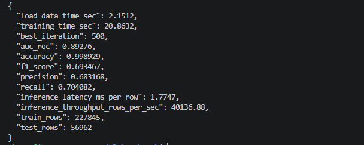
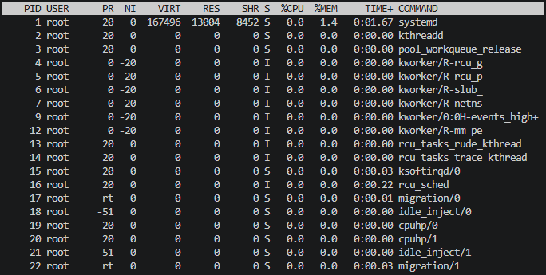
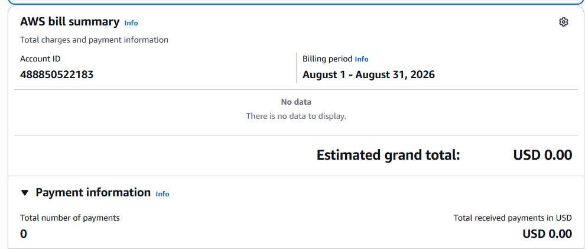

# Báo cáo Lab 16 — CPU + LightGBM trên AWS

Hạ tầng được triển khai bằng Terraform trên AWS (VPC riêng, Bastion Host, NAT Gateway, ALB), với Compute Node chạy LightGBM. Do tài khoản AWS mới bị giới hạn chỉ được chạy instance thuộc Free Tier, Compute Node dùng `t3.micro` (1 vCPU / ~914MB RAM khả dụng) thay vì `t3.medium` mặc định.

Với 227,845 dòng train / 56,962 dòng test (30 đặc trưng), mô hình LightGBM (500 cây, learning rate 0.05) huấn luyện chỉ trong **20.6 giây**, cho thấy gradient boosting trên CPU vẫn rất khả thi ngay cả với phần cứng tối thiểu. AUC-ROC đạt **0.893** — hợp lý nhưng chưa tối ưu do dữ liệu mất cân bằng nặng (~0.17% giao dịch gian lận) và chưa xử lý imbalance (ví dụ `scale_pos_weight`, SMOTE) hay tinh chỉnh hyperparameter.

Precision (0.683) và Recall (0.704) tương đối cân bằng (F1 = 0.693), cho thấy ngưỡng phân loại mặc định (0.5) hoạt động chấp nhận được nhưng có thể cải thiện bằng cách tinh chỉnh threshold theo bài toán cụ thể (ưu tiên Recall hay Precision tuỳ chi phí False Negative/Positive trong gian lận thẻ). Đáng chú ý nhất là **inference rất nhanh**: latency chỉ 1.67ms/dòng và throughput đạt ~39,164 dòng/giây — đủ nhanh để phục vụ real-time fraud scoring dù chạy trên instance CPU nhỏ nhất.

Kết luận: LightGBM là lựa chọn phù hợp cho bài toán fraud detection khi cần tốc độ inference cao và chi phí hạ tầng thấp, không cần GPU. Hướng cải thiện tiếp theo: xử lý mất cân bằng dữ liệu, tune hyperparameter (num_leaves, max_depth), và thử nghiệm với instance CPU lớn hơn (t3.medium) để so sánh training time khi có nhiều tài nguyên hơn.

## Ảnh minh chứng

**1. Terminal chạy `benchmark.py`**

**2. Resource usage (CPU/RAM) trên Compute Node — lệnh `top`**

**3. AWS Billing Dashboard**

*Lưu ý: AWS Billing Dashboard có độ trễ cập nhật (thường 12-24 giờ), nên tại thời điểm chụp (hạ tầng mới chạy được khoảng 1 giờ) chưa hiển thị chi phí thực (`USD 0.00`). Đây là hiện tượng bình thường với tài khoản mới, không phải lỗi triển khai — tài nguyên EC2 (Bastion + Compute Node), NAT Gateway và ALB vẫn đang chạy và tính phí theo ước tính ~$0.10/giờ trong README.*
